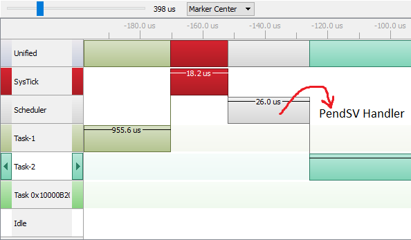

# FreeRTOS Notes

## Time Base Source Selection
* FreeRTOS uses ARM Cortex Mx Processor's internal SysTick timer as its timer base (RTOS ticking).  
* STM32 Cube HAL Layer by default also uses the SysTick timer as its base time source.  
* If we are using both FreeRTOS and STM32Cube HAL Layer in our project, there will be a conflict to use a time source.  
* To resolve this conflict, it is strongly recommended to use STM32 Cube HAL Layer time-base source to some other timer peripheral of the micro-controller.  


## Scheduling
* When the tasks are created using `xTaskCreate` function, they are automatically added into the ready task list of the FreeRTOS (ready state).  
* Tasks will be dispatched to run on the CPU by the scheduler.  
* Scheduler is nothing but a piece of code that is part of the FreeRTOS kernel, which runs in the privileged mode of the processor.  
* Firstly the scheduler should be invoked by calling the API provided by FreeRTOS i.e. `vTaskStartScheduler()`  

### Scheduling Policy
Scheduler schedules tasks to run on the CPU according to the scheduling policy configured.  
1) **Preemptive Scheduling** => when `configUSE_PREEMPTION = 1 `  
   Preemption is replacing a running task with another task. During preemption, the running task is made to give up the processor even if it hasn't finished the work. The scheduler does this to run some other tasks of the application.  
   The tasks which gave up the processor simply returns to the ready state.  
   There are further two types of preemptive scheduling as mentioned below.  
   * Round-Robin (Cyclic) Preemptive Scheduling : Fixed time slice is used for each task  
   * Priority Base Preemptive Scheduling  
     In this type of scheduling the tasks are scheduled to run of the CPU based on their priority. As task with higher priority will be made to run on the CPU forever unless the task gets deleted/blocked/suspended of leaves voluntarily to give chance to other tasks.  
2) **Cooperative Scheduling** => when `configUSE_PREEMPTION = 0 `
    * Task cooperates with other tasks by explicitly giving up the processor (processor yielding).
    * There is no preemption of the tasks by the scheduler i.e. the running task will never be interrupted by the scheduler.
    * The RTOS tick interrupt doesn't cause any preemption, but the tick interrupt are still needed to keep track of the kernel's real-time tick value.
    * Tasks give up the CPU when they are done or periodically or blocked or suspended waiting for a resource.

### FreeRTOS Scheduler Implementation
In FreeRTOS the scheduler code is actually a combination of `FreeRTOS Generic Code (tasks.c)` + `Architecture specific codes (ports.c)` .  
#### Architecture Specific Codes
Architecture Specific codes are responsible to achieve the scheduling of the tasks.  
  * All architecture specific codes and configurations are implemented in `port.c` & `portmacro.h`.  
  * If ARM Cortex Mx Processors are used, then we should be able to locate the below three interrupt handlers in `port.c` which are the part of the scheduler implementation of the FreeRTOS.  
    * `vPortSVCHandler()` : Used to launch the very first task, and is triggered by SVC instruction of ARM.  [Check `vTaskStartScheduler` API](#vtaskstartscheduler)  
    * `xPortPendSVHandler()` : Used to achieve the context switching between tasks, and is triggered by pending the PendSV System Exception of the ARM.  
      Also check [Context Switching](#context-switching)
        
    * `xPortSysTickHandler()` : This implements the RTOS Tick management, and is triggered periodically by SysTick Timer of ARM Cortex Mx Processor.  
        


## Idle Task
  * The Idle Task is created automatically when the RTOS scheduler is started to ensure there is always at least one task that is able to run.  
  * It is created at the lowest priority to ensure it does not use any CPU time if there are higher priority application tasks in the ready state.  
  * The Idle Task is responsible for freeing memory allocated by the RTOS to the tasks that have been deleted.  
  * When there are no tasks running, Idle task will always run on the CPU.  
  * We can give an application hook function in the Idle Task to send the CPU to low power mode when there are no useful tasks executing.  

## Timer Services Task (Timer_SVC)
  * This is also called as "Timer Daemon Task"
  * The timer daemon task deals with "Software Timers"
  * The task is created automatically when the scheduler is started and if `configUSER_TIMERS = 1` in the `FreeRTOSConfig.h` file.  
  * The RTOS uses this daemon to manage the FreeRTOS software timers and nothing else.  
  * If we don't use the software timer in our FreeRTOS application then we have disable this using `configUSER_TIMERS = 0` in the `FreeRTOSConfig.h` file.  
  * All Software timer callback functions execute in the context of the timer daemon task.  

## Context Switching
  * Context Switching is a process of switching out of one task and switching in of another task on the CPU to execute.  
  * In RTOS, Context Switching is taken care by the scheduler.  
  * In FreeRTOS Context Switching is taken care by the `PendSV_Handler` found in the `port.c` file.  
  * Whether Context Switch should happen or not depends upon the scheduling policy of the scheduler.  
  * If the scheduler is priority based preemptive scheduler, then for every RTOS tick interrupt, the scheduler will compare the priority of the running task with the priority of ready tasks list. **If there is any ready task with higher priority than the running task the context switch will occur**.  
  * On FreeRTOS we can also trigger the context switch manually using the `taskYIELD` macro.  
  * Context Switch also happen immediately whenever new task unblocks and if its priority is higher than the currently running task.  
  

## FreeRTOS API's
### Task Creation API
This API creates a new FreeRTOS task using dynamic memory allocation and adds the newly created task to ready queue of the kernel.  
```
BaseType_t xTaskCreate( TaskFunction_t pvTaskCode,          /* Address of the associated Task Handler : Function Pointer */
                        const char * const pcName,          /* Descriptive name to identify the task */
                        configSTACK_DEPTH_TYPE usStackDepth,/* Amount of Stack Memory allocated to this task */
                        void *pvParameters,                 /* Pointers of the data which needs to be passed to the task handler, once it gets scheduled*/
                        UBaseType_t uxPriority,             /* Task Priority Value */
                        TaskHandle_t *pxCreatedTask );      /* Used to save the Task Handle (an address of the task created) */
```

### vTaskStartScheduler()
* This is implemented in `tasks.c` of the FreeRTOS kernel and used to start the RTOS scheduler.  
* After calling this function only the scheduler code is initialized and all the architecture specific interrupts will be activated.  
* This function also creates the `Idle Task` and the `Timer Daemon Task`.  
* This function calls `xPortStartScheduler()` to do the architecture specific initialization.  
  And this architecture specifics functions, perform the three major tasks which are as below.  
  * Configure the `SysTick` timer to issue the interrupts at the desired rate (as configured in the config item `configTICK_RATE_HZ` in FreeRTOSConfig.h file).  
  * Configures the priority for the PendSV and SysTick interrupts.  
  * Starts the first task by executing the SVC instruction.  


### vTaskDelay() and vTaskDelayUntil()
These API's are used to delay a task without engaging the processor (replacement for for/while loop based crude delay implementation), and these are are used for the implementation of the periodic tasks.  
`vTaskDelay` API, is a blocking delay API that blocks the task for the specified RTOS ticks. For the next specified RTOS ticks other lower priority tasks of the system can run. And after this specified RTOS ticks are expired the task wakes up and enters the READY state.  
`vTaskDelayUntil` API is used to delay a task until specified time. This function can be used by periodic tasks to ensure a constant execution frequency.  
```
void vTaskDelayUntil( TickType_t *pxPreviousWakeTime,       /* Pointer to a variable that holds the time at which task was unblocked last time */
                      const TickType_t xTimeIncrement );    /* The cycle time period */
```
This function differs from `vTaskDelay()` in one important aspect: `vTaskDelay()` specifies a time at which the task wishes to unblock relative to the time at which `vTaskDelay()` is called, whereas `vTaskDelayUntil()` specifies an absolute time at which the task wishes to unblock.  


### vTaskSuspendAll and xTaskResumeAll
`vTaskSuspendAll` API suspends the scheduler. Suspending the scheduler prevents a context switching from occurring but leaves interrupts enabled. If an interrupt requests a context switch while the scheduler is suspended, then the request is held pending and is performed only when the scheduler is resumed.  
`xTaskResueAll` API can be used to resume the scheduler state from the suspended state.  

### xTaskNotify and xTaskNotifyWait
```
 BaseType_t xTaskNotify( TaskHandle_t xTaskToNotify,  /* Handle of the task being notified */
                         uint32_t ulValue,            /* Index within the target task array notification values to which the notification is to be sent*/
                         eNotifyAction eAction );     /* enum type that can take one of the values documented */   

 BaseType_t xTaskNotifyIndexed( TaskHandle_t xTaskToNotify, 
                                UBaseType_t uxIndexToNotify, 
                                uint32_t ulValue, 
                                eNotifyAction eAction );
```
Each task has an array of 'task notifications' (or just 'notifications'), each of which has a state and a 32-bit value. A direct to task notification is an event sent directly to a task that can unblock the receiving task, and optionally update one of the receiving tasks notification values in a number of different ways. For example, a notification may overwrite one of the receiving task's notification values, or just set one or more bits in one of the receiving task's notification values.  
`xTaskNotify()` is used to send an event directly to and potentially unblock an RTOS task, and optionally update one of the receiving tasks notification values in one of the following ways:  
* Write a 32-bit number to the notification value  
* Add one (increment) the notification value  
* Set one or more bits in the notification value  
* Leave the notification value unchanged  
`xTaskNotify()` and `xTaskNotifyIndexed()` are equivalent functions - the only difference being `xTaskNotifyIndexed()` can operate on any task notification within the array and xTaskNotify() always operates on the task notification at array index 0.  

```
BaseType_t xTaskNotifyWait( uint32_t ulBitsToClearOnEntry,
                             uint32_t ulBitsToClearOnExit,
                             uint32_t *pulNotificationValue,
                             TickType_t xTicksToWait );

 BaseType_t xTaskNotifyWaitIndexed( UBaseType_t uxIndexToWaitOn, 
                                    uint32_t ulBitsToClearOnEntry, 
                                    uint32_t ulBitsToClearOnExit, 
                                    uint32_t *pulNotificationValue, 
                                    TickType_t xTicksToWait );
```