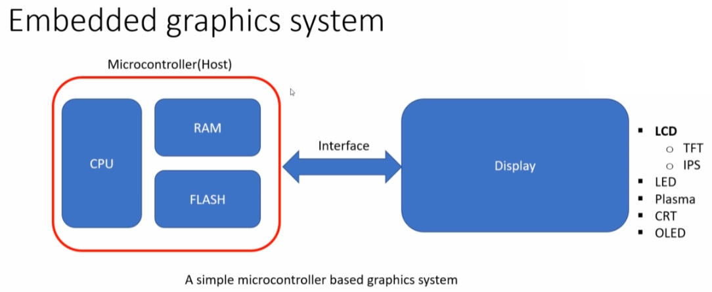
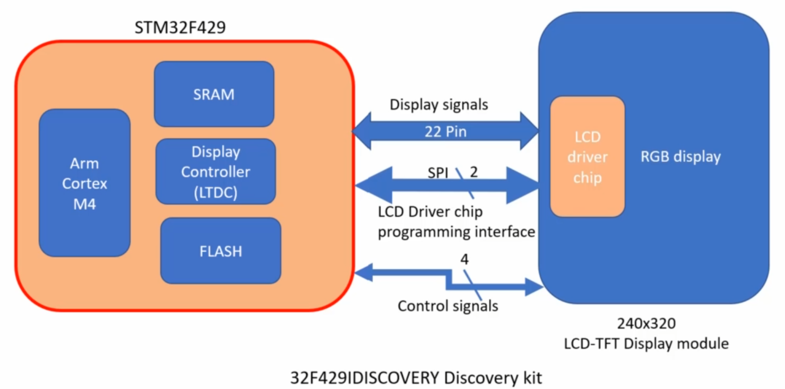
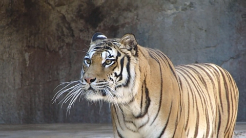

## Graphics Application
A microcontroller based interactive application which may involve any of the below components to display on the display device.
* Colours
  * Color of the texts
  * Background Color/Layer Color
* Shapes
  * Box
  * Circle
  * Arrows
  * Lines
* Images
* Texts
* Graphical Effects (Scrolling, Sliding, Swipe, Press, Release)
* Widgets (Simple Button, Radio Button, Check Box, Videos )
* 3D Rendering
* Gaming

## Embedded Graphics System



### Important Part of the Embedded Graphics System
* A Microcontroller (Host)
  * Processor (Executes our code, updates the buffer)
  * RAM (FRAME Buffer)
  * Flash (Static Images, Fonts, Texts etc )
* Display Module
  * Glass (Where we see the graphics)
  * Driver Chip (Interpret the signals sent by the host, generates required electric signals and voltages to lit the pixel of the display panel)

**Frame Buffer: A memory area which holds the pixel values of the frame to be updated on the display**

### Some Other Important Part of the Embedded Graphics System
* Display Controller
  * Present on the Host Side
  * Generates display timing related signals
  * Transmit Pixel Data  
  In STM32 there is a peripheral called LTDC which stands for LCD TFT Display Controller, this is a bus master, this takes directly the pixel data from the frame buffer and it can send it to the display module over LTDC module.
* External Memories
  * External Flash (our code plus graphic components such as images text, this may not fit inside the internal flash)
  * External RAM
* Graphics Library (LVGL, TouchGFX, emWin, Embedded Wizard etc. )
* UI designer tool
  * To create an interactive UI application
* Touch Sensing
  * Touch Panel
  * Touch Screen Controller (Which senses the touch panel and inform the host)
* DMA
  * Helps to transfer frame buffer to display without the intervention of the CPU
  * Helps to transfer the graphics details from the flash to frame buffer without the intervention of the CPU.


The following diagram shows how TFT is connected to the STM32F429 development kit.  

  

There are around 22 pins that are used for display signals. The microcontroller sends the color information over these display pins.  
There is a SPI communication also, it is used for LCD driver chip programming, so first we have to configure the LCD driver chip using these lines and then only we can send the display information on above display lines.  
There are some control signals also for this LCD driver chip, which are controlled by the host, these are basically used to interpret the command and  data.  

## RGB Display and Pixel
A display which taskes red-green-blue signal components of a pixel to generate the colors to be displayed on the screen.  
RGB is a model in which Red-Green-Blue primary colors are added together in various ways to reproduce a broad array of colors.  
### Some Important Terminologies
* Pixel
  * Pixel of the image is the smallest information (color information) of the image stored in computer memory.  
  
  * Image information is as below.  
  ```
  Dimension is 480x270
  width is 480 pixels
  height is 270 pixels
  Bit Depth is 32 (this means each pixel is of 32 bits )
  ```
  * Similarly the Pixel of Display is also the smallest glowing (color producing) electronic element of the display module.  
  * **How much memory does one pixel consume in the computer memory?**  
    * This is also called as **Pixel Depth**, **Color Depth** or **Bit Depth**  
    * This depends on the pixel format and is measured in bpp (bits per pixel)  
* Pixel Density (PPI-Pixel Per Inch)
  * Pixel Density is measured in PPI which means Pixel Per Inch.
  * It denotes how many pixels are there in per inch of the display.
  * More pixels/inch means more clarity of the image and texts shown on the display.
  * As PPI of the display increases, it is capable of showing high resolution images (more pixel information) in less space without or with less degradation of the quality of the image.
* Pixel Color Depth (Bit Depth)
* Pixel Format (Color Formats)
  * The following tables shows some pixel formats (color formats).  

    | Pixel Format  | 	Description                                     |
    | ------------- | ------------------------------------------------- |
    | ARGB8888	    | 32 bits, 8 bits per component                     |
    | L8_ARGB8888	  | 8 bits indexed format, ARGB8888 palette           |
    | RGB888	      | 24 bits, 8 bits per component                     |
    | L8_RGB888	    | 8 bits indexed format, RGB888 palette             |
    | RGB666	      | 24 bits, 6 bits per component                     |
    | RGB565	      | 16 bits, 5 bits red, 6 bits green, 5 bits blue    |
    | L8_RGB565     |	8 bits indexed format, RGB565 palette             |
    | ARGB2222      |	8 bits, 2 bits per component                      |
    | ABGR2222      |	8 bits, 2 bits per component                      |
    | RGBA2222      |	8 bits, 2 bits per component                      |
    | BGRA2222      |	8 bits, 2 bits per component                      |
    | GRAY4	        | 4 bits grayscale                                  |
    | GRAY2	        | 2 bits grayscale                                  |
    | BW	          | 1 bit grayscale                                   |
    | BW_RLE	      | 1 bit grayscale run-length encoded                |
  
  * **ARGB8888** if an image is represented in ARGB8888 pixel format, that means each of that image consumes 32 bits (32bpp) in memory, and each pixel has 4 components.
    * Alpha (Opacity) component of 8 bits
    * Red Color component of 8 bits
    * Green Color component of 8 bits
    * Blue Color component of 8 bits
  * L8 Formats
    * This represents the color of the image by color lookup table (CLUT).
    * The L8 format, 8 bit index value is used to look for the color value in the predefined lookup table.
    * This helps in saving memory, a comparison is given below.

    | Frame Buffer  | 	Pixel Format  | Total Memory Consumed           |
    | ------------- | --------------- | ------------------------------- |
    | 470x270       | RGB888          | 470 * 270 * 3 = 3805kb          |
    | 470x270       | L8_RGB888       | 470 * 270 * 1 + 256*3 = 127.3kb |
* Resolution
  * It is the number of pixels used to represents an image arranged in standard graphics display width and height dimensions.
  * An image 1600x900(HD+ resolution) will portray more details about the image than 1280x720(HD resolution) image.
  * Display Resolution is the number of pixels available in a given size of the display arranged in standard graphics display width and height dimensions.

## Converting BMP Images to C Array
### How many Bytes of memory does an image consume?
Resolution of the bitmap image is 480x270.  
Pixel Format is ARGB8888.  
```
Total Memory Consumed = Width X Height X (bpp/8) = 480 X 270 X 32/8  
Total Memory Consumed = 506.25 KB
```
### BMP Images
* An BMP Image file contains uncompressed pixel data, hence consumes more space on the disk.
  * BMP file cosists of File Meta Data and Uncompressed Pixel Data.
* We can directly read the pixel values and display them on the display module.
  * This is also an advantage of using the bmp images, but it consumes more space, contrary to that we can use jpeg images but the data is in compressed format and hence a jpeg decoder middleware is needed or there are now many microcontrollers with jpeg decoder peripheral.

### Converting BMP to C Array
There are basically a lot of free tools available for this purpose or we can create one our own also. But LVGL also provides an online tool for this purpose and that can be found under the following link.  
[Image Converter Tool LVGL](https://lvgl.io/tools/imageconverter)

### Selecting Pixel Format for the application
This depends of the following things.  
* Pixel format support by the LCD Driver chip.
* Desired Color Range.
* Microcontroller RAM space availability.
* Microcontroller FLASH space availability.

The Roaring tiger image has approximate size of 506KB and it is in format ARGB888, and if we consider our hardware the total on-chip flash is 2MB and RAM is 256KB only.  
But the LCD Driver which wer using i.e. ILI9341 supports only RGB565/RGB666/RGB222 Pixel Formats only.  
Let's say we selected RGB565 pixel format, RGB565 1pixel consumes 2 bytes and hence if we have to display three images or frames.
```C
= (320 x 240 x 2) * 3 = 450 KB    // NOTE: the display dimension is 320 x 240
```

## LCD TFT Display Controller
### LTDC Peripheral of the ST Microcontroller
* First we have to configure and enable the LTDC peripheral (LCD TFT Display Controller) of the microcontroller
* LTDC of the MCU generates all synchronization and timings signals and transfers RGB components to the display.
* Display which has a display driver chip that interprets those signals and drives the display panel to light the desired pixels.

### Display Interface Types
* MIPI DPI (Display Pixel Interface)
* MIPI DBI (Display Bus Interface/MCU Interface)
* MIPI DSI (Display Serial Interface)

### MIPI
The above display interfaces are standarized by MIPI which stands for Mobile Industry Process Interface Alliance.  
* MIPI Alliance develops interface specifications for mobile and mobile-influenced devices.
* In the mobile industry, companies use MIPI Alliance specifications when developing smartphones, tablets, laptops and hybrid devices.

#### MIPI DPI
* This is also called as RGB Interface.
* Applies to display interface which uses 16/18/24-bit data lines and control signals.
* The MIPI DPI specification standardizes the data and control signals to be used by manufacturers of mobile device processors, cameras, and display.
* The DPI interface is typically used when the display module doesn't support the frame buffer (GRAM). The host controller must stream the data in real-time to the display.
* This is the one used in STM32F4 Discovery Kit which we are using.

#### MIPI DBI (Display Bus Interface)
* This is also known as MCU Interface
* The MIPI DBI is used to interface with a display module with an integrated graphic RAM (GRAM). The pixel data is first updated in the local GRAM of the display driver chip which repeatedly refreshes the display.
* Host and Display Module can be connected by simple GPIO's.
* Types of MIPI-DBI are:
  * DBI Type-A: based on Motorola 6800 bus
  * DBI Type-B: based on Intel 8080 bus
  * DBI Type-C: based on SPI Protocol (3 or 4 line SPI Interface)

### RGB Interface Signals
#### VSync
* This is a vertical synchronization signal sent from the host display controller (LTDC) to the display module.
* This signal marks the _start/beginning of the new frame_. That means, when this signal asserts, the display module understands that the host controller is going to send a new frame.

#### HSync
* This is a horizontal synchronization signal sent from the host display controller (LTDC) to the display module.
* This signal marks the _start of a new line of the frame_. That means, when the signal asserts, the display module understands that the host controller will send  a new line of current frame.

#### DE
* This is sent from the host controller (LTDC) and indicates whether the RGB data is valid or not.
* When `DE=0`, the display module doesn't read the RGB data because it is invalid.
* When `DE=1`, the display module reads the RGB data and displays it.

#### DOTCLK (PCLK)
* The clock signal is sent from the host controller (LTDC) to read the RGB data when `DE=1`, display module reads the RGB data during the rising edge of the DOTCLK.
* This also indicates how fast RGB data is made available to the display module.

#### RGB Data Lines
* The host controller must support 24-bit data lines to carry RGB data.
* This display modules samples these data lines only when `DE=1` during the rising edge of the DOTCLK.
* Note that the display does not need to support the 24 data lines to accept RGB data. We have to check the display module's pin capability while interfacing.


