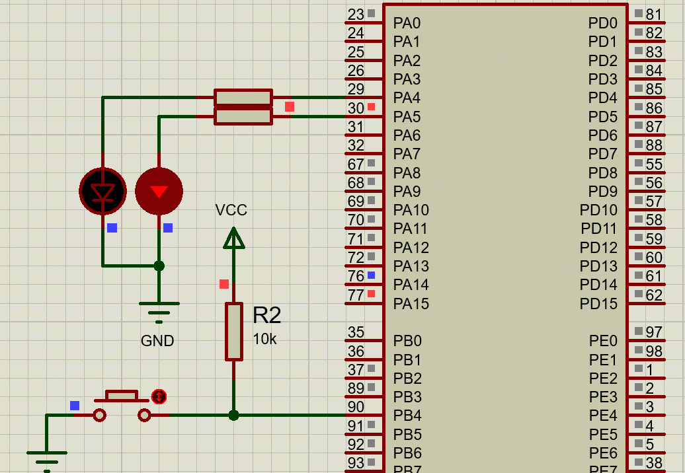

# STM32F4 Example Using Proteus Simulation

### Button and LEDs
In simulation we have created two LEDs and 1 button which can be used for waking up micro or for external input.

| Reference | Color | Name | Comment |
| --------- | ----- | ---- | ------- |
| D1 | BLUE | USER | PB4 Pin of Micro Alternate Function Wake-Up |
| B2 | BLACK | RESET | TODO |
| D1 | RED | USER1 | PA5 Pin of micro |
| D2 | GREEN | USER2 | PA5 Pin of micro |

### Led Blink Example
