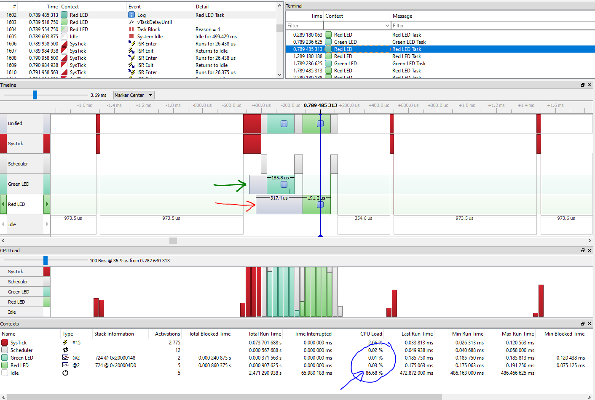

[](https://www.paypal.me/embeddedlab)

# STM32F4 
The following are the projects which doesn't use the STM32CubeMX tools for device configuration
### 01-HelloWorld
**Project Path** - `Without_Cube/01-HelloWorld`  
**Development Environment** - STM32CubeIDE/IAR/Make/CMake (Windows and Ubuntu)  
This is a simple `Hello World` project, where the main idea is to build the first project and use ITM Unit of the STM32F429I micro-controller to use use `printf` style debugging.  
This is only applicable for Cortex M3/M4/M7 or higher micro-controllers `printf` works over SWO (Serial Wire Output) pin of the SWD interface.  
If we have a board based on Cortex-M0/M0+ then we have to use OpenOCD based semi-hosting technique to use `printf`.  
In ARM Cortex-M4 processor there is a Unit called as ITM. ITM means Instrumentation Trace Macrocell Unit. The ITM is an optional application driven trace source that supports `printf` style debugging to trace operating system and application events, and generates diagnostic system information. And this unit is not available in Cortex-M0/M0+ processor.  

Note: The project is build for STM32F429I-DISCO board, and by default SWO port is not connected, we need to solder the SB9 bridge on the board, please check user manual of the board.  

#### CMake Integration
With the help of `STM32CubeMx` software the `Makefile` based project can be generated, and then using the simple `make` command the project can be build.  
Then based on this `Make` file a `CMakeLists.txt` file is created, the sample is already available.  
```CMake
OPTION( GNU_IAR_COMPILER_SELECT "Set ON for GNU and OFF for IAR" ON )
```
With the above mentioned line, we can generate the build system either for `GNU GCC ARM` compiler or for `IAR` compiler, both are tested and worked fine.  

**Windows**  
The `GNU GCC ARM` compiler is already installed while installing the `STM32CubeIDE`, and that's why the only task to build the project on Windows is to add the compiler path to Environment Variables. A sample path of the compiler installation is given below.
```bash
C:\ST\STM32CubeIDE\STM32CubeIDE\plugins\com.st.stm32cube.ide.mcu.externaltools.gnu-tools-for-stm32.10.3-2021.10.win32_1.0.0.202111181127\tools\bin
```
This path must be added to the environment variables on Windows Operating System.  
And once done the following commands can be used to generate the build system and finally build/compile the project(Sample project is available in the repository).  
```CMake
mkdir build
cd build
cmake -G "MinGW Makefiles" --toolchain=../cmake/arm-none-eabi-gcc.cmake -DCMAKE_BUILD_TYPE=Debug ..
cmake --build
# OR
# when building from the root folder
cmake -Bbuild -G "MinGW Makefiles" --toolchain=cmake/arm-none-eabi-gcc.cmake
cmake --build build
```

The above method is for `GNU GCC ARM` compiler, instead of using `STM32CubeIDE` based compiler, we can directly use the compiler from ARM website and use it.  
For IAR Compiler the steps are also very simple and a very good tutorial is already available, officially from IAR Company. And the command to be used is as shown below.  
```CMake
cmake -BbuildIAR -G "Ninja Multi-Config" --toolchain .\cmake\iar-toolchain.cmake
cmake --build build
```
Make sure the `Ninja` is installed on the Windows machine, and the path is added to the environment variable.

**Ubuntu**  
IAR Embedded Workbench is not available on Ubuntu/Linux, a build system is available, but I don't have it, so as of now it is not possible to use the IAR Compiler on Linux machine.  
So, we have the choice to only use the `GNU GCC ARM` compiler, which is free of cost, again `STM32CubeIDE` can be downloaded from the website, but here the approach used will be to not use the IDE, and use the compiler directly from the ARM Website, the benefit of using this approach is that we can use the same compiler for other vendors ARM specific chip without installing their IDE's, for example I don't need to install NXP's `MCUXpresso` IDE.  

There is already a good tutorial available online on YouTube and the link is as below.  

[GNU Toolchain Setup for STM32 Inside Linux and Using Makefiles for Build and Flash](https://www.youtube.com/watch?v=imUiQkO9YHM)

The idea is simple, and is summarized in the following steps.  
1. Download the ARM Embedded Tool Chain from the website "https://developer.arm.com/downloads/-/gnu-rm"
2. For Ubuntu/Linux, we just need to extract and we are ready to use the ARM compiler.
3. But usually it is better to move these extracted compiler files to the `/opt/gcc-arm/` directory, and then add this parth into the environment variable
4. Adding this path into the environment variable can be done using the following command.
    ```bash
    export PATH="/opt/GCC-ARM/gcc-arm-none-eabi-10.3-2021.10/bin/:$PATH"
    ```
   *I have faced a problem with this step, whenever I am closing my terminal session the path added recently is gone, I will investigate on this topic later.*  
   **The problem is solved now, we have to update the `.bashrc` file, this is the first script file which is executed when the user logs in. Use the below mentioned command to update the environment variables.**
   ```bat
   # Open the file in a text editor
   gedit ~/.bashrc
   ```
   And then add the following lines (of-course depends on the version we have download), at the bottom of the file.  
   ```bash
   # Added by me
   PATH=$PATH:/opt/GCC-ARM/gcc-arm-none-eabi-10.3-2021.10/bin
   export PATH
   ```
   After this, we can access the `arm-none-eabi-gcc` and other respective files from the command line.  

5. Since we have already exported the `STM32CubeMx` project as `Makefile` project, we can use the `make` command to see if the project is building or not.
6. Similary the same `CMakeLists.txt` can be used to compile in `Ubuntu`, with a slight difference, instead of using `MinGW Makefiles` we have to use `Unix Makefiles`, as shown below.
   ```bash
   cmake -Bbuild -G "Unix Makefiles" --toolchain=cmake/arm-none-eabi-gcc.cmake
   cmake --build build
   ```
   
7. This is an optional step, by default the `apt repo` of Ubuntu is not updated with the latest version of the `CMake`, so in this case it is better to use the latest version directly downloaded from the internet.
8. If older version is installed use `sudo apt-get remove cmake` command.
9. Download the latest version of `CMake` from the official website, the file comes with `*.sh` extension.
10. Create a folder in `/opt/cmake` directory and install the `CMake` here.
11. Then again we are stuck in the same problem to access the `CMake` from anywhere in `Terminal` and since my export PATH is not working on internet I searched on Internet and I found a command to create a shorcut for this and is mentioned below.
   ```
   // make a directory in opt folder
   sudo mkdir /opt/cmake
   // move the *.sh installer file into this folder
   sudo mv cmake-3.26.2-linux-x86_64.sh /opt/cmake/
   // install CMake
   sudo mv cmake-3.26.2-linux-x86_64.sh /opt/cmake/
   // make a shortcut for CMake
   sudo ln -s /opt/cmake/cmake-3.26.2-linux-x86_64/bin/cmake /usr/local/bin/
   ```
   NOTE: The same approach we can't do for `ARM GNU GCC` compiler, the reason is there are many files to be used and we have to make a lot of shortcuts and that's why not recommended.  

### 02-HelloWorld-SemiHosting
**Project Path** - `Without_Cube/02-HelloWorld-Semihosting`  
**Development Environment** - STM32CubeIDE  
Implementation of `printf` feature using ARM Cortex M3/M4 ITM functionality is only limited to high-end processors such as Cortex M3/M4/M7.  
So in case we wanted to use the `printf` functionality for debugging on Cortex M0/M0+ we can use OpenOCD based Semi-Hosting. Here we have to update the linker arguments with the following flags.  
```-specs=rdimon.specs -lc -lrdimon```  
Instead of using ST-Link Debugger, we have to use ST-Link (OpenOCD) and then we need to call the function "initialise_monitor_handles()" at start-up and simply use `printf` function with \n character at last.  
Apart from this while debugging the project we have to use ST-Link Open OCD as debugger, and in the startup section of the debugger configuration we have to mention the following command.  
```monitor arm semihosting enable```  
And apart from all this we have to exclude the `syscalls.c` file from the build. If we don't follow all these steps the semihosting will not work properly.  

### 03-HSI_Measurement
**Project Path** - `Without_Cube/03-HSI_Measurement`  
**Development Environment** - STM32CubeIDE  
In this example we will do the HSI (High Speed Internal Oscillator) Clock Measurement, these clocks whether HSI or HSE can be connected to MCO1, which is micro-controller output-1,and then we can use GPIO's alternate function to connect this MCO1 output to PA8 pin of GPIOA.  
It should also output 16MHz (16MHz is internal RC on this discovery board) so it should output the same frequency, but since the Logic Analyzer which I  am using is pretty slow, I will pre-scale the output by 4, and will only get 4MHz on the PA8 pin of GPIOA.  
  

### 04-HSE_Measurement
**Project Path** - `Without_Cube/04-HSE_Measurement`  
**Development Environment** - STM32CubeIDE  
In this example we will do the HSE (High Speed External Clock) Clock Measurement, these clocks whether HSI or HSE can be connected to MCO1, which is micro-controller output-1,and then we can use GPIO's alternate function to connect this MCO1 output to PA8 pin of GPIOA.  
It should also output 8MHz (8MHz is external crystal oscillator connected on the discovery board) so it should output the same frequency, but since the Logic Analyzer which I  am using is pretty slow, I will pre-scale the output by 4, and will only get 2MHz on the PA8 pin of GPIOA.  
  


## FreeRTOS
All the FreeRTOS based projects are started with the name FreeRTOS appened at the starting of the folder.  
I have prepared some notes on FreeRTOS which can be accessed by [clicking here](FreeRTOS_ReadMe.md).  

### FreeRTOS_HelloWorld
**Project Path** - `Without_Cube/FreeRTOS_HelloWorld`  
**Development Environment** - STM32CubeIDE  
This is a simple Hello World project using FreeRTOS, where it is added manually, apart from this SEGGER's SystemView is also integrated to record the events taking place and display it on SEGGER SystemView Host Application.  


### FreeRTOS_LedTasks
**Project Path** - `Without_Cube/FreeRTOS_LedTasks`  
**Development Environment** - STM32CubeIDE  
This is a simple FreeRTOS project, where we have taken the `FreeRTOS_HelloWorld` project as base project, in this project the idea is to toggle the user Leds i.e. LD3 (Green LED) and LD4 (Red LED), in two separate tasks created in FreeRTOS.  
  


The above image is from the recorder catured using the SEGGER SystemView, here it can be seen that the CPU time is wasted un-necessarily in processing the delays i.e. `HAL_Delay`.  
These types of tasks are known as Continous Tasks, while these can be converted into Periodic Tasks, where CPU will peform the actions and move to Idle Task, saving CPU bandwidth which can be used for several other purposes like putting the CPU into low power mode.  
And this can be used with the usage of `vTaskDelayUntil` function, and once this is done and after recording the events we see the following.  
  
As highlighted with the blue color, **the CPU is now in Idle state for 86.68%**, and as seen with green highlighted arrow, the Led Green tasks unblocks and runs and the again moved to block state, and same thing happened with the Led Red tasks, hence preventing the CPU bandwidth usage.  


### FreeRTOS_TaskNotify
**Project Path** - `Without_Cube/FreeRTOS_TaskNotify`  
**Development Environment** - STM32CubeIDE  
This is a simple FreeRTOS project, where we have taken the `FreeRTOS_HelloWorld` project as base project. In this project we have three tasks running, two tasks for led togglings at different rate, and one button task to detect the button press. If the button is pressed for the first time, the first Led task will be deleted and if the button is again pressed for one more time the second led task will also be deleted, and this task should also delete the button task, as it will not have anything to do. This example is basically created to learn the `vTaskNotify`  

  

As can be seen in the above image, that Red and Green Tasks were executing but when the button is pressed, the button task sends an notification to green led tasks, and as an action green led task has turned on the green led and deleted itself, the same is repeated for red led task also.  


### FreeRTOS_ButtonISR
**Project Path** - `Without_Cube/FreeRTOS_ButtonISR`  
**Development Environment** - STM32CubeIDE  
This is a simple FreeRTOS project, where we have taken the `FreeRTOS_HelloWorld` project as base project. In this project we have two tasks running, two tasks for led togglings at different rate, and one button is configured to generate interrupt on falling edge i.e. when pressed and released.  
This button ISR will send a notifcation to the tasks to delete the tasks, here the important point is that we can't use `vTaskNotify` FreeRTOS API's, here we have to use the `vTaskNotifyFromISR` FreeRTOS API's, because we are sending notification from interrupt.  

  

As can be seen in the above image, when ISR22 occurs (which is for External Interrupt), our Green Led task becomes ready, but still the FreeRTOS was executing the Idle task, until the SysTick interrupts again, as can be see in the above there is a delay of around 800 useconds, and this is not good, ideally the task should execute right away because Idle Task in not a high priority task as compared to the Green Led task.  
But this problem can be solved by using the `pxHigherPriorityTaskWoken` field of the `xTaskNotifyFromISR` FreeRTOS API as shown below.  
`xTaskNotifyFromISR( next_task_handle, 0, eNoAction, &pxHigherPriorityTaskWoken);`  
If pxHigherPriorityTaskWoken is set to pdTRUE, when sending the notification caused a task to unblock, and the unblocked task has the priority higher than
the currently running task, and then by using the function/macro call `portYIELD_FROM_ISR(pxHigherPriorityTaskWoken)`, this issue can be solved, aslo shown in the below image.  
  
As can be seen from the above image, ISR22 causes the Green Led task handler to ready state and then scheduler is run to make a switch to Green Led task handler function.  
